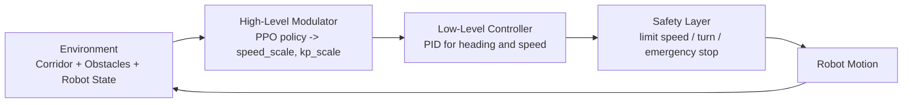

# Safety-Guarded RL-Modulated PID Control


这个项目做的不是“端到端 RL 替代控制器”，而是一个更具体、也更容易检验的问题：

> 在二维走廊避障场景里，强化学习能不能根据局部风险，在线调整 PID 的控制风格，并在独立安全规则兜底下，比固定 PID 更灵活？

核心设计：

- RL 不直接输出最终速度和角速度
- RL 只调两件事：目标速度上限、航向 `Kp`
- PID 负责稳定执行
- 安全层负责把危险动作拦在执行前


## 介绍

仓库当前包含两条完整链路：

1. 一个可本地启动的 HTML 演示页
2. 一个独立单文件 PPO 训练脚本，能产出可被演示系统直接加载的模型

演示页可以实时显示：

- 走廊、障碍、机器人轨迹
- 固定 PID / RL-PID / Safety-Guarded RL-PID 三种模式切换
- `speed_scale`、`kp_scale`
- PID 原始输出
- 安全层覆盖后的最终动作
- 接管原因、接管强度、局部风险量

## 系统结构



### 三层职责

| 层 | 负责什么 | 不负责什么 |
|---|---|---|
| 环境层 | 产生低维风险观测和几何场景 | 不直接做控制决策 |
| RL 调节层 | 根据局部风险调 `speed_scale`、`kp_scale` | 不直接接管底层动作 |
| PID 层 | 稳定跟踪速度和航向参考 | 不理解“当前风险是否变高” |
| 安全层 | 在执行前限速、限角速度、紧急停车 | 不替代策略学习 |

## 仓库内容

```text
.
├── demo_server.py            # 本地演示服务，加载模型并驱动前端
├── train_ppo_standalone.py   # 单文件 PPO 训练脚本
├── launch_demo.bat           # Windows 一键启动脚本
├── web/
│   ├── index.html            # 演示页面结构
│   ├── app.js                # 交互与可视化逻辑
│   └── styles.css            # 页面样式
└── models/
    └── ppo_policy.pt         # 训练后生成，可选
```

## 快速开始

### 1. 启动演示

Windows 下直接双击：

```powershell
launch_demo.bat
```

或者手动启动本地服务：

```powershell
python demo_server.py --host 127.0.0.1 --port 8000
```

然后打开：

```text
http://127.0.0.1:8000/
```

### 2. 训练真实 PPO 模型

训练脚本是完全独立文件，不需要 import 本仓库其他模块：

```powershell
python train_ppo_standalone.py --device cuda --total-updates 220 --num-envs 64 --steps-per-rollout 256 --epochs 6 --minibatch-size 2048 --save-path models/ppo_policy.pt
```

如果服务器有 CUDA，脚本会直接用 GPU；如果没有，就自动回落到 CPU。

快速烟雾测试：

```powershell
python train_ppo_standalone.py --total-updates 1 --num-envs 8 --steps-per-rollout 32 --epochs 1 --minibatch-size 64 --save-every 1 --eval-episodes 2 --save-path models/ppo_policy.pt
```

训练完成后，`demo_server.py` 会优先加载：

```text
models/ppo_policy.pt
```

找不到模型时，系统才会回退到内置启发式调节器。

## 训练脚本说明

`train_ppo_standalone.py` 里已经包含：

- 随机场景生成：开阔走廊、单侧障碍、窄缝、低速动态障碍
- 与演示服务一致的观测编码方式
- PPO rollout、GAE、clip loss、value loss、entropy regularization
- 模型定期保存与简单评估
- 可直接落盘为服务可加载的 `.pt` 文件

默认动作空间仍然是两维：

- `speed_scale ∈ [0.22, 1.20]`
- `kp_scale ∈ [0.75, 2.10]`

## 演示页怎么读

如果你在页面上切换到不同模式，建议重点看这几组差异：

- `fixed_pid`
  - 控制稳定，但遇到局部冲突时风格不变
- `rl_pid`
  - 会根据风险主动调速度和转向敏感度
- `safety_guarded_rl_pid`
  - 在 RL 调参基础上，再加执行前安全拦截

页面里最值得观察的是：

- 前向风险上升时是否主动降速
- 偏航增大时 `Kp` 是否提高
- 接近障碍或边界时安全层是否接管
- 风险解除后是否恢复推进，而不是一直卡住

## API 概览

演示服务提供的是最小接口，不做复杂封装：

- `GET /api/state`
- `POST /api/reset`
- `POST /api/step`
- `POST /api/set_policy_mode`

返回数据包含：

- `robot`
- `corridor`
- `obstacles`
- `observation_summary`
- `rl_modulation`
- `pid_output`
- `safe_action`
- `safety_status`
- `episode_status`


## 运行要求

- Python 3.10+
- `torch`
- Windows 下可以直接用 `launch_demo.bat`
- Linux / 服务器环境直接运行 Python 命令即可

 模型导出为更轻量的推理格式
